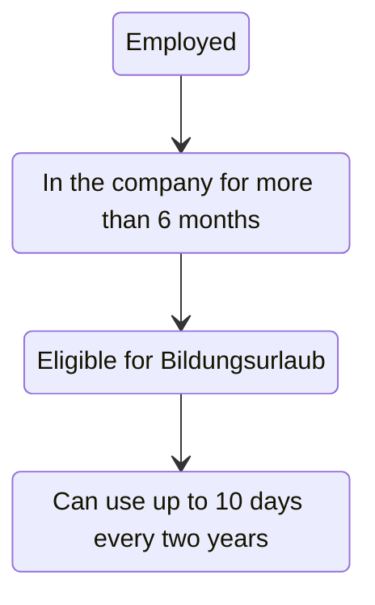
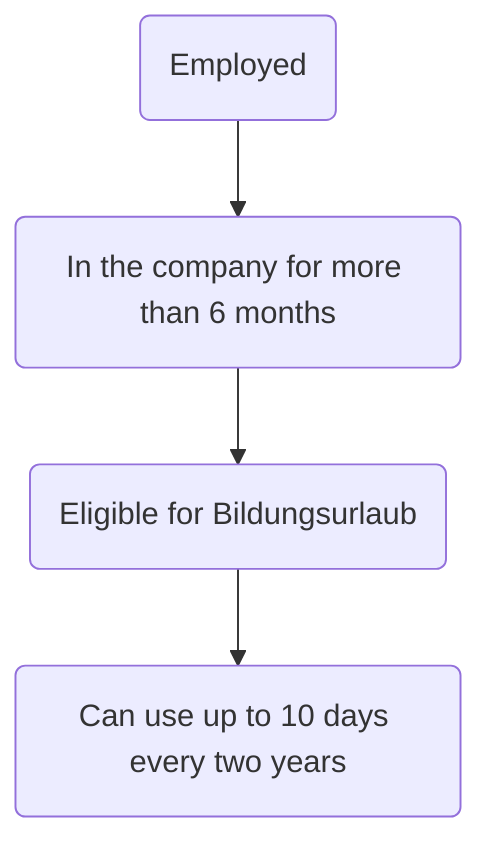

### Scenario eligibility for Bildungsurlaub

### Scenario eligibilitz for Bildungsurlaub, flowchart version

<!-- mmdc -i app/components/schema/mermaid.md -o mermaid.md -->
<!-- https://github.com/mermaid-js/mermaid-cli -->
